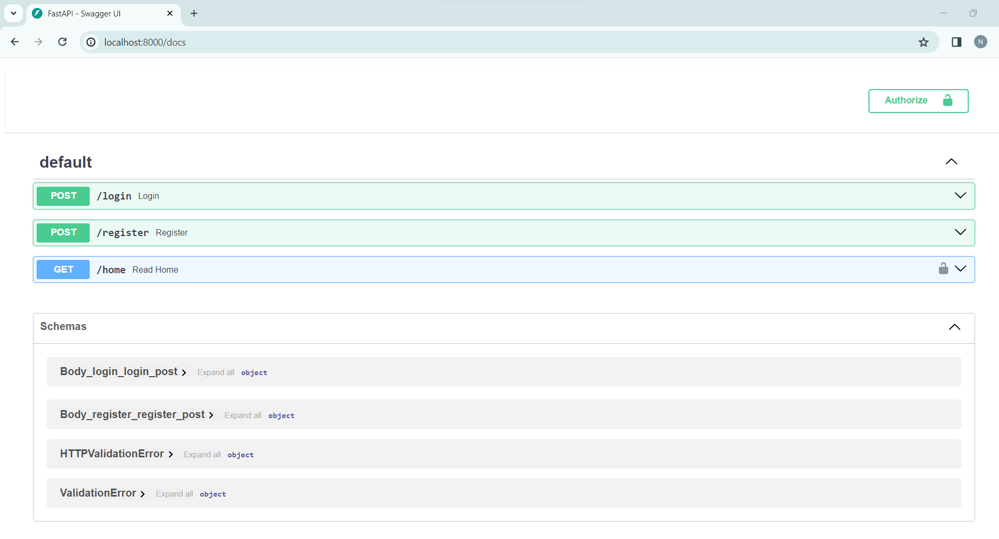

# FastAPI Application


## Installation

First, install the necessary Python libraries by running the following command:

```bash
pip install -r requirements.txt
```


## Running the Application
To run the application, use the following command from the root directory of the project:

```bash
uvicorn main:app --reload
```

Then, you can access the application at http://localhost:8000.

API Endpoints
To test the application, you can visit http://localhost:8000/docs 
